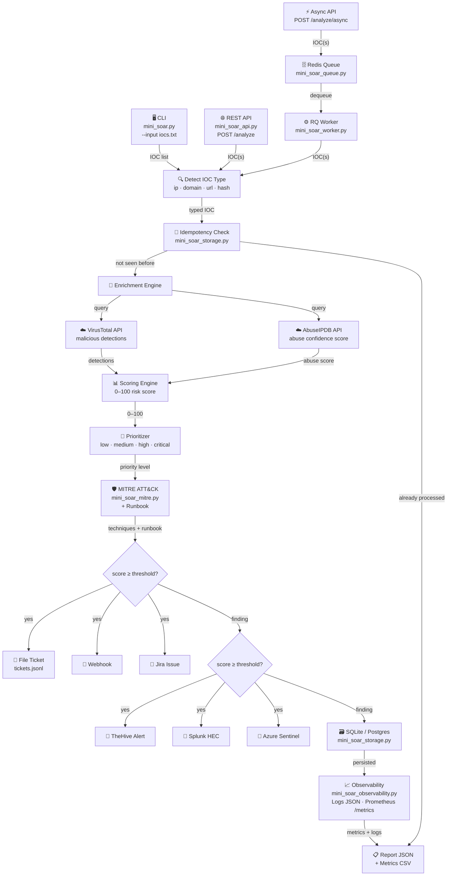

# Mini SOAR for SOC (Python)

Projeto de automação de segurança focado em fluxo SOC real:
- Enriquecimento de IOC (VirusTotal + AbuseIPDB)
- Scoring e priorização de risco
- Resposta automática (ticketing e integrações)
- API segura e modo assíncrono com fila
- Observabilidade, persistência e testes

## Por que este projeto é relevante

Este projeto demonstra competências práticas cobradas em vagas de Cybersecurity Junior e Pleno:
- `Python` para automação de segurança
- `Threat Intelligence` e triagem de IOC
- `Detection & Response` com lógica de priorização
- `SOAR/SIEM integration` (TheHive, Splunk, Sentinel)
- `API Security` (API Key/JWT + rate limiting)
- `Reliability` (retry/backoff, idempotência, persistência)
- `Engineering quality` (testes automatizados + CI/CD)

## O que ele faz

1. Recebe IOC(s) por CLI ou API.
2. Detecta o tipo do IOC (`ip`, `domain`, `url`, `hash`).
3. Enriquece com fontes de threat intel.
4. Calcula score de risco e prioridade.
5. Opcionalmente abre ticket e envia para integrações.
6. Anexa mapeamento MITRE ATT&CK + runbook de resposta.
7. Gera relatório JSON e métricas CSV.

## Arquitetura



### Módulos

| Arquivo | Responsabilidade |
|---|---|
| `mini_soar.py` | CLI + modo interativo |
| `mini_soar_core.py` | Pipeline principal — orquestra todo o fluxo |
| `mini_soar_api.py` | API FastAPI (`/analyze`, `/analyze/async`, `/jobs/{id}`, `/metrics`) |
| `mini_soar_queue.py` | Fila assíncrona (RQ/Redis) |
| `mini_soar_worker.py` | Worker que consome a fila |
| `mini_soar_storage.py` | Persistência e idempotência (SQLite/Postgres) |
| `mini_soar_observability.py` | Logs estruturados + métricas Prometheus |
| `mini_soar_mitre.py` | Mapeamento MITRE ATT&CK + runbook de resposta |
| `tests/` | Suíte pytest |

## Rodar em 1 comando (Docker)

Subir stack completa (`API + Redis + Worker`):

| Windows (PowerShell) | Linux / Mac (Bash) |
|---|---|
| `.\start_stack.ps1` | `./start_stack.sh` |
| `.\stop_stack.ps1` | `./stop_stack.sh` |

```powershell
# Windows
.\start_stack.ps1
```

```bash
# Linux / Mac
chmod +x start_stack.sh stop_stack.sh
./start_stack.sh
```

Endpoints:
- Dashboard: `http://127.0.0.1:8000`
- API Docs:  `http://127.0.0.1:8000/docs`
- Health:    `http://127.0.0.1:8000/health`
- Metrics:   `http://127.0.0.1:8000/metrics`

## Modo Demo (sem API keys)

Quer testar o fluxo completo sem precisar de chaves reais? Ative o modo demo:

```powershell
# CLI
$env:MINI_SOAR_DEMO_MODE="true"
python .\mini_soar.py --input .\iocs.txt --ticket-backend none --output .\report.json
```

```powershell
# API
$env:MINI_SOAR_DEMO_MODE="true"
uvicorn mini_soar_api:app --host 0.0.0.0 --port 8000
```

No modo demo:
- O enriquecimento é **simulado** — nenhuma chamada externa é feita
- Os dados são **determinísticos**: o mesmo IOC sempre gera o mesmo score
- Os resultados cobrem todas as faixas: `low`, `medium`, `high` e `critical`
- O relatório JSON inclui `"demo_mode": true`
- O endpoint `/health` indica `"enrichment": "mock (demo)"`

> ⚠️ Dados simulados não representam inteligência de ameaças real.

## Uso rápido (sem Docker)

Instalar dependências:

```powershell
python -m pip install -r .\requirements.txt
```

Subir localmente (API + Worker automático):

| Windows (PowerShell) | Linux / Mac (Bash) |
|---|---|
| `.\start_local.ps1` | `./start_local.sh` |
| `.\stop_local.ps1` | `./stop_local.sh` |

```bash
# Linux / Mac
chmod +x start_local.sh stop_local.sh
./start_local.sh
```

Ou manualmente:

```powershell
# CLI
python .\mini_soar.py --input .\iocs.txt --ticket-backend none --output .\report.json

# API
uvicorn mini_soar_api:app --host 0.0.0.0 --port 8000
```

## Exemplo de chamadas da API

Análise síncrona:

```powershell
curl -X POST http://127.0.0.1:8000/analyze ^
  -H "Content-Type: application/json" ^
  -d "{\"ioc\":\"8.8.8.8\",\"ticket_backend\":\"none\"}"
```

Análise assíncrona (fila):

```powershell
curl -X POST http://127.0.0.1:8000/analyze/async ^
  -H "Content-Type: application/json" ^
  -d "{\"iocs\":[\"8.8.8.8\",\"example.com\"],\"integration_targets\":[\"splunk\"]}"
```

Consultar status do job:

```powershell
curl http://127.0.0.1:8000/jobs/SEU_JOB_ID
```

## Segurança e confiabilidade

- API Key/JWT (configurável por env)
- Rate limiting por cliente
- Retry com backoff para conectores externos
- Idempotência para reduzir alert storm
- Persistência de findings (SQLite ou Postgres)
- Logs estruturados e correlação por `correlation_id`
- Métricas Prometheus

## Qualidade de engenharia

- Testes unitários e de API com `pytest`
- Pipeline CI no GitHub Actions (`py_compile + pytest`)

Rodar testes:

```powershell
pytest -q
```

## Variáveis de ambiente

Use `.env.example` como referência para:
- chaves de threat intel
- autenticação de API
- integração com plataformas
- configuração de fila e banco
- parâmetros de confiabilidade

## Como um recrutador pode avaliar em 5 minutos

1. Subir stack com `.\start_stack.ps1`.
2. Abrir `http://127.0.0.1:8000/docs`.
3. Testar `/analyze` com IOC simples.
4. Testar `/analyze/async` e consultar `/jobs/{id}`.
5. Verificar relatório de saída e métricas em `/metrics`.

## Observações

- Projeto para defesa/capacitação em cybersegurança.
- Não versionar chaves reais de API.

