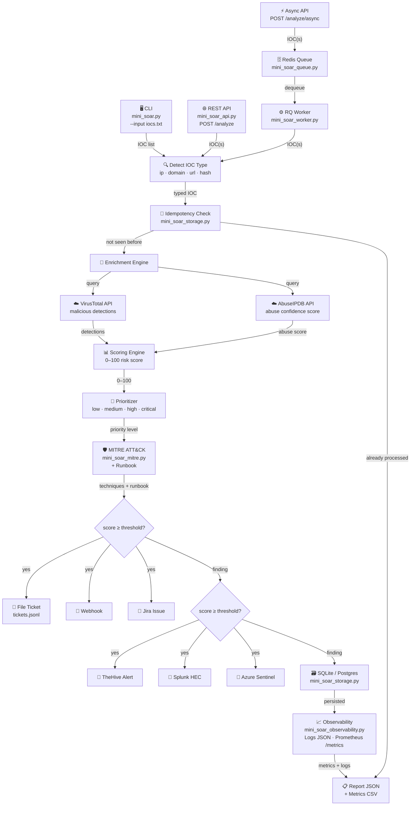

# Mini SOAR for SOC (Python)

[](https://github.com/vianakaique12/Projeto-SentinelCore-SOAR-Blue-Team-Automation/actions/workflows/ci.yml)
[](https://codecov.io/gh/vianakaique12/Projeto-SentinelCore-SOAR-Blue-Team-Automation)


Projeto de automação de segurança focado em fluxo SOC real:
- Enriquecimento de IOC (VirusTotal + AbuseIPDB)
- Scoring e priorização de risco
- Resposta automática (ticketing e integrações)
- API segura e modo assíncrono com fila
- Observabilidade, persistência e testes

## Por que este projeto é relevante

Este projeto demonstra competências práticas cobradas em vagas de Cybersecurity Junior e Pleno:
- `Python` para automação de segurança
- `Threat Intelligence` e triagem de IOC
- `Detection & Response` com lógica de priorização
- `SOAR/SIEM integration` (TheHive, Splunk, Sentinel)
- `API Security` (API Key/JWT + rate limiting)
- `Reliability` (retry/backoff, idempotência, persistência)
- `Engineering quality` (testes automatizados + CI/CD)

## O que ele faz

1. Recebe IOC(s) por CLI ou API.
2. Detecta o tipo do IOC (`ip`, `domain`, `url`, `hash`).
3. Enriquece com fontes de threat intel.
4. Calcula score de risco e prioridade.
5. Opcionalmente abre ticket e envia para integrações.
6. Anexa mapeamento MITRE ATT&CK + runbook de resposta.
7. Gera relatório JSON e métricas CSV.

## Arquitetura



### Módulos

| Arquivo | Responsabilidade |
|---|---|
| `mini_soar.py` | CLI + modo interativo |
| `mini_soar_core.py` | Pipeline principal — orquestra todo o fluxo |
| `mini_soar_api.py` | API FastAPI (`/analyze`, `/analyze/async`, `/jobs/{id}`, `/metrics`) |
| `mini_soar_queue.py` | Fila assíncrona (RQ/Redis) |
| `mini_soar_worker.py` | Worker que consome a fila |
| `mini_soar_storage.py` | Persistência e idempotência (SQLite/Postgres) |
| `mini_soar_observability.py` | Logs estruturados + métricas Prometheus |
| `mini_soar_mitre.py` | Mapeamento MITRE ATT&CK + runbook de resposta |
| `tests/` | Suíte pytest |

## Rodar em 1 comando (Docker)

Subir stack completa (`API + Redis + Worker`):

| Windows (PowerShell) | Linux / Mac (Bash) |
|---|---|
| `.\start_stack.ps1` | `./start_stack.sh` |
| `.\stop_stack.ps1` | `./stop_stack.sh` |

```powershell
# Windows
.\start_stack.ps1
```

```bash
# Linux / Mac
chmod +x start_stack.sh stop_stack.sh
./start_stack.sh
```

Endpoints:
- **Dashboard**: `http://127.0.0.1:8000/dashboard` ← visão geral dos findings, gráficos, filtros e exportação CSV
- Analyzer:   `http://127.0.0.1:8000`
- API Docs:  `http://127.0.0.1:8000/docs`
- Health:    `http://127.0.0.1:8000/health`
- Metrics:   `http://127.0.0.1:8000/metrics`

## Modo Demo (sem API keys)

Quer testar o fluxo completo sem precisar de chaves reais? Ative o modo demo:

```powershell
# CLI
$env:MINI_SOAR_DEMO_MODE="true"
python .\mini_soar.py --input .\iocs.txt --ticket-backend none --output .\report.json
```

```powershell
# API
$env:MINI_SOAR_DEMO_MODE="true"
uvicorn mini_soar_api:app --host 0.0.0.0 --port 8000
```

No modo demo:
- O enriquecimento é **simulado** — nenhuma chamada externa é feita
- Os dados são **determinísticos**: o mesmo IOC sempre gera o mesmo score
- Os resultados cobrem todas as faixas: `low`, `medium`, `high` e `critical`
- O relatório JSON inclui `"demo_mode": true`
- O endpoint `/health` indica `"enrichment": "mock (demo)"`

> ⚠️ Dados simulados não representam inteligência de ameaças real.

## Uso rápido (sem Docker)

Instalar dependências:

```powershell
python -m pip install -r .\requirements.txt
```

Subir localmente (API + Worker automático):

| Windows (PowerShell) | Linux / Mac (Bash) |
|---|---|
| `.\start_local.ps1` | `./start_local.sh` |
| `.\stop_local.ps1` | `./stop_local.sh` |

```bash
# Linux / Mac
chmod +x start_local.sh stop_local.sh
./start_local.sh
```

Ou manualmente:

```powershell
# CLI
python .\mini_soar.py --input .\iocs.txt --ticket-backend none --output .\report.json

# API
uvicorn mini_soar_api:app --host 0.0.0.0 --port 8000
```

## Exemplo de chamadas da API

Análise síncrona:

```powershell
curl -X POST http://127.0.0.1:8000/analyze ^
  -H "Content-Type: application/json" ^
  -d "{\"ioc\":\"8.8.8.8\",\"ticket_backend\":\"none\"}"
```

Análise assíncrona (fila):

```powershell
curl -X POST http://127.0.0.1:8000/analyze/async ^
  -H "Content-Type: application/json" ^
  -d "{\"iocs\":[\"8.8.8.8\",\"example.com\"],\"integration_targets\":[\"splunk\"]}"
```

Consultar status do job:

```powershell
curl http://127.0.0.1:8000/jobs/SEU_JOB_ID
```

## Idempotência e Deduplicação

O SentinelCore evita reprocessar o mesmo IOC múltiplas vezes dentro de uma janela temporal configu­rável. Isso reduz chamadas desnecessárias às APIs externas (VirusTotal, AbuseIPDB) e evita *alert storms* em pipelines automatizados.

### Como funciona

```
IOC recebido
    │
    ▼
hash_ioc(ioc, ioc_type)  →  SHA-256( lower(ioc) + "|" + lower(ioc_type) )
    │
    ▼
ioc_seen table: last_seen >= now - window?
    │                         │
   Sim                       Não
    │                         │
    ▼                         ▼
get_cached_finding()     Enriquecimento normal
    │                    (VirusTotal + AbuseIPDB)
    ▼                         │
Retorna finding anterior       ▼
  {skipped: true,        Salva finding
   cached: true,         mark_ioc_seen()
   risk_score: <real>}
```

1. A cada submissão, a chave de idempotência é **SHA-256(lower(ioc) + "|" + lower(ioc_type))**.
2. A tabela `ioc_seen` registra `first_seen`, `last_seen` e `seen_count`.
3. Se o IOC foi processado dentro da janela, o **finding completo** (com score real, MITRE, runbook) é retornado diretamente da tabela `findings` — sem consultar APIs externas.
4. Fora da janela, o IOC é reprocessado normalmente e o resultado é salvo novamente.

O finding retornado em cache inclui as flags:
```json
{ "skipped": true, "cached": true, "risk_score": 55, "priority": "high", ... }
```

### Configurar a janela temporal

| Variável de ambiente | Padrão | Descrição |
|---|---|---|
| `MINI_SOAR_ENABLE_IDEMPOTENCY` | `true` | Liga/desliga a deduplicação |
| `MINI_SOAR_IDEMPOTENCY_WINDOW_SECONDS` | `3600` | Janela em segundos (1 hora) |
| `MINI_SOAR_DATABASE_URL` | `sqlite:///mini_soar.db` | Banco onde o histórico é guardado |
| `MINI_SOAR_PERSIST_FINDINGS` | `true` | Deve estar `true` para cache funcionar |

Exemplos de janela:

```bash
# 10 minutos
MINI_SOAR_IDEMPOTENCY_WINDOW_SECONDS=600

# 24 horas
MINI_SOAR_IDEMPOTENCY_WINDOW_SECONDS=86400

# Desabilitar (sempre reprocessa)
MINI_SOAR_ENABLE_IDEMPOTENCY=false
```

### Exemplo: mesmo IOC duas vezes dentro da janela

```powershell
# 1ª submissão — enriquecimento real
curl -X POST http://127.0.0.1:8000/analyze `
  -H "Content-Type: application/json" `
  -d '{"ioc":"8.8.8.8"}'
# → {"risk_score": 55, "skipped": false, ...}

# 2ª submissão (dentro de 1 hora) — retorna cache
curl -X POST http://127.0.0.1:8000/analyze `
  -H "Content-Type: application/json" `
  -d '{"ioc":"8.8.8.8"}'
# → {"risk_score": 55, "skipped": true, "cached": true, ...}
```

```bash
# CLI — analisa o mesmo arquivo duas vezes
python mini_soar.py --input iocs.txt --output report1.json
python mini_soar.py --input iocs.txt --output report2.json
# report2.json: todos os IOCs com "skipped": true, "cached": true
```

### Como desabilitar

```bash
# Via env var
export MINI_SOAR_ENABLE_IDEMPOTENCY=false

# CLI — flag direta
python mini_soar.py --disable-idempotency --input iocs.txt
```

Quando desabilitado, cada submissão executa o pipeline completo independentemente do histórico.

---

## Rate Limiting

O SentinelCore aplica um limite de requisições por IP (sliding window) em todos os endpoints da API.

### Backends disponíveis

| Backend | Quando usar | Como ativar |
|---|---|---|
| `memory` (padrão) | Desenvolvimento / single worker | padrão, nenhuma config necessária |
| `redis` | Produção / múltiplos workers | `MINI_SOAR_RATE_LIMIT_BACKEND=redis` |

#### In-Memory (padrão)

Usa um dicionário Python + threading.Lock dentro do processo. Funciona perfeitamente com um único worker Uvicorn.

**Limitação**: com múltiplos workers (`--workers 4`), cada processo mantém seu próprio contador, então o limite efetivo por cliente se torna `limite × número_de_workers`. Um aviso é emitido no log de inicialização quando esse cenário é detectado.

```bash
# Single worker — limite exato
uvicorn mini_soar_api:app --host 0.0.0.0 --port 8000
```

#### Redis (multi-worker / produção)

Usa um sorted set no Redis com uma **Lua script atômica** para garantir que o check-and-add seja race-free. Todos os workers compartilham o mesmo contador, então o limite configurado é respeitado globalmente.

Cada cliente tem uma chave `mini_soar:rl:<ip>` com TTL automático para limpeza.

```bash
# Produção com 4 workers
MINI_SOAR_RATE_LIMIT_BACKEND=redis
MINI_SOAR_RATE_LIMIT_REDIS_URL=redis://localhost:6379/0
uvicorn mini_soar_api:app --host 0.0.0.0 --port 8000 --workers 4
```

Se o Redis estiver indisponível ao iniciar, o sistema faz fallback automático para in-memory com um aviso no log.

### Variáveis de ambiente do rate limiting

| Variável | Padrão | Descrição |
|---|---|---|
| `MINI_SOAR_API_RATE_LIMIT` | `60` | Máximo de requests por janela |
| `MINI_SOAR_API_RATE_WINDOW_SECONDS` | `60` | Tamanho da janela (segundos) |
| `MINI_SOAR_RATE_LIMIT_BACKEND` | `memory` | `memory` ou `redis` |
| `MINI_SOAR_RATE_LIMIT_REDIS_URL` | `redis://localhost:6379/0` | URL do Redis (backend redis) |
| `WEB_CONCURRENCY` / `UVICORN_WORKERS` | `1` | Detectado para emitir aviso multi-worker |

---

## Segurança e confiabilidade

- API Key/JWT (configurável por env)
- Rate limiting por cliente (in-memory ou Redis para multi-worker)
- Retry com backoff para conectores externos
- Idempotência para reduzir alert storm
- Persistência de findings (SQLite ou Postgres)
- Logs estruturados e correlação por `correlation_id`
- Métricas Prometheus

## Testes e Cobertura

### Rodar testes

```bash
# Rápido — sem relatório de cobertura
pytest -q

# Com resumo de cobertura no terminal
pytest --cov=. --cov-report=term-missing -q

# Gerar relatório HTML navegável
pytest --cov=. --cov-report=html -q
# Abrir: htmlcov/index.html
```

### Relatório HTML local

Após rodar `pytest --cov=. --cov-report=html`, abra o relatório no browser:

```bash
# Linux / Mac
open htmlcov/index.html

# Windows
start htmlcov/index.html
```

O relatório mostra linha a linha quais trechos estão cobertos (verde) e quais não estão (vermelho).

### Cobertura mínima

O arquivo `.coveragerc` define `fail_under = 60` — o CI falha automaticamente se a cobertura global cair abaixo de 60%.
Para verificar o threshold localmente:

```bash
pytest --cov=. --cov-fail-under=60 -q
```

### O que está excluído da medição

Configurado em `.coveragerc`:

| Padrão excluído | Motivo |
|---|---|
| `tests/*` | Arquivos de teste não medem a si mesmos |
| `if __name__ == "__main__":` | Bloco de entrada CLI, não testável via pytest |
| `except ImportError / ModuleNotFoundError` | Dependências opcionais (psycopg, rq, jwt) |
| `if TYPE_CHECKING:` | Imports só para type checkers, nunca executados |
| `raise NotImplementedError` | Stubs abstratos |

### CI e badge

O pipeline CI (`.github/workflows/ci.yml`) roda em Python 3.11 e 3.12 e:
1. Instala dependências (`requirements.txt` + `ruff`)
2. Valida sintaxe com `py_compile` em todos os módulos
3. Roda `pytest --cov` e verifica o threshold
4. Faz upload do relatório para [Codecov](https://codecov.io) (apenas Python 3.12)

O badge de cobertura no topo do README é atualizado automaticamente a cada push no master.

---

## Qualidade de engenharia

- Testes unitários e de API com `pytest` + `pytest-cov`
- Pipeline CI no GitHub Actions (`lint + py_compile + pytest --cov + codecov`)
- Cobertura mínima de 60% aplicada no CI

## Variáveis de ambiente

Use `.env.example` como referência para:
- chaves de threat intel
- autenticação de API
- integração com plataformas
- configuração de fila e banco
- parâmetros de confiabilidade

## Como um recrutador pode avaliar em 5 minutos

1. Subir stack com `.\start_stack.ps1`.
2. Abrir `http://127.0.0.1:8000/docs`.
3. Testar `/analyze` com IOC simples.
4. Testar `/analyze/async` e consultar `/jobs/{id}`.
5. Verificar relatório de saída e métricas em `/metrics`.

## Observações

- Projeto para defesa/capacitação em cybersegurança.
- Não versionar chaves reais de API.

